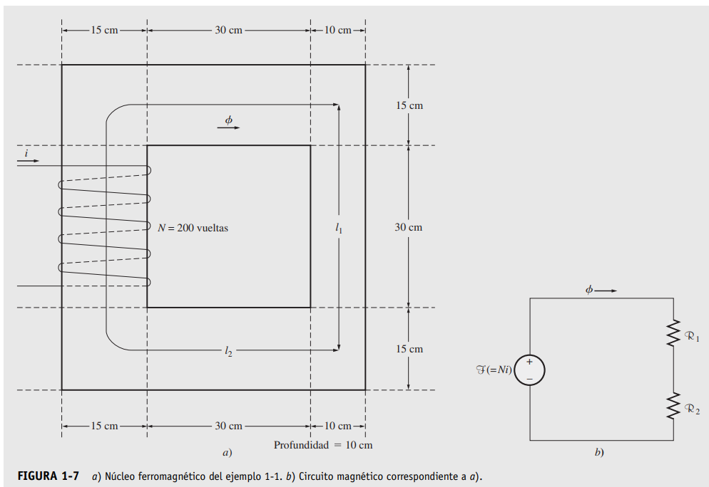
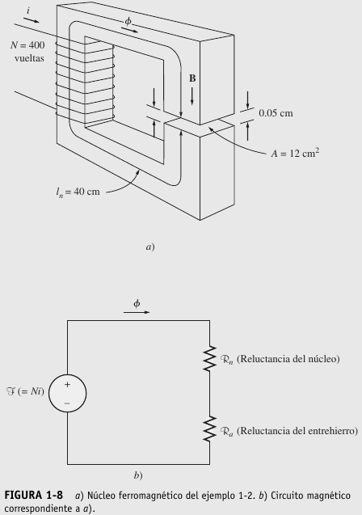
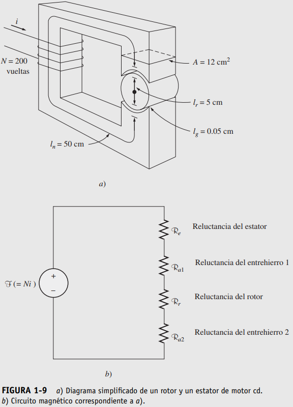

# Electric machines exercises

Electric machine exercises for the ITM subject "Electric Machines II" from the book "Máquina Eléctricas Ed. 5", Chapman.
The exercises are divided in two topics: magnetics circuits and induction motor.

## Magnetic circuits

### Exercise 1-1

En la figura 1-7a) se observa un núcleo ferromagnético. Tres lados de este núcleo tienen una anchura
uniforme, mientras que el cuarto es un poco más delgado. La profundidad del núcleo visto es de 10 cm
(hacia dentro de la página), mientras que las demás dimensiones se muestran en la figura. Hay una bobina
de 200 vueltas enrollada sobre el lado izquierdo del núcleo. Si la permeabilidad relativa mr es de 2 500,
¿qué cantidad de flujo producirá una corriente de 1 A en la bobina?

### Exercise 1-2

La figura 1-8a) muestra un núcleo ferromagnético cuya longitud media es de 40 cm. Hay un pequeño en-
trehierro de 0.05 cm en la estructura del núcleo. El área de la sección transversal del núcleo es de 12 cm2,
la permeabilidad relativa del núcleo es de 4 000 y la bobina de alambre en el núcleo tiene 400 vueltas. Su-
ponga que el efecto marginal en el entrehierro incrementa 5% la sección transversal efectiva del entrehie-
rro. Dada esta información, encuentre a) la reluctancia total del camino del flujo (hierro más entrehierro)
y b) la corriente requerida para producir una densidad de flujo de 0.5 T en el entrehierro.

### Exercise 1-3

La figura 1-9a) muestra un rotor y un estator sencillos de un motor de cd. La longitud media del recorrido
del fl ujo en el estator es de 50 cm, y el área de su sección transversal es de 12 cm2. La longitud media
correspondiente al rotor es de 5 cm y el área de su sección transversal también es de 12 cm2. Cada entrehierro
entre el rotor y el estator tiene un ancho de 0.05 cm y el área de su sección transversal (incluyendo
el efecto marginal) es de 14 cm2. El hierro del núcleo tiene una permeabilidad relativa de 2 000, y hay 200
vueltas alrededor del núcleo. Si la corriente en el alambre se ajusta a l A, ¿cuál será la densidad de flujo
resultante en el entrehierro?

--------------------------------------------------------------------------------------------------------------

## Induction motor

### Exercise 1

Se tiene un motor de inducción trifásico con conexión en estrella de 5 hp, 60 Hz, 1800 rpm y 440V con los
siguientes parámetros:

$r_1 = 1.5\; \Omega$

$r_2 = 1.2\; \Omega$

$jX = 6\; \Omega$ (total)

$jX_m = 110\; \Omega$

$R_m = 900\; \Omega$

$s = 0.2$
