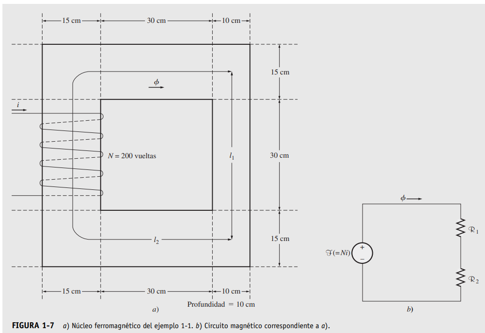

# Electric machines exercises

A compilation of electric machine exercises for the ITM subject "Electric Machines II" from Chapman.

## Exercise 1-1

En la figura 1-7a) se observa un núcleo ferromagnético. Tres lados de este núcleo tienen una anchura
uniforme, mientras que el cuarto es un poco más delgado. La profundidad del núcleo visto es de 10 cm
(hacia dentro de la página), mientras que las demás dimensiones se muestran en la figura. Hay una bobina
de 200 vueltas enrollada sobre el lado izquierdo del núcleo. Si la permeabilidad relativa mr es de 2 500,
¿qué cantidad de flujo producirá una corriente de 1 A en la bobina?

