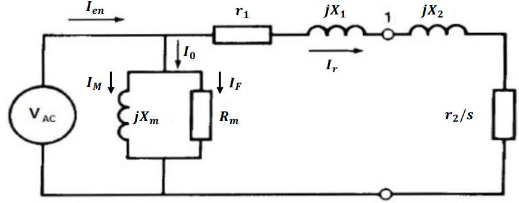
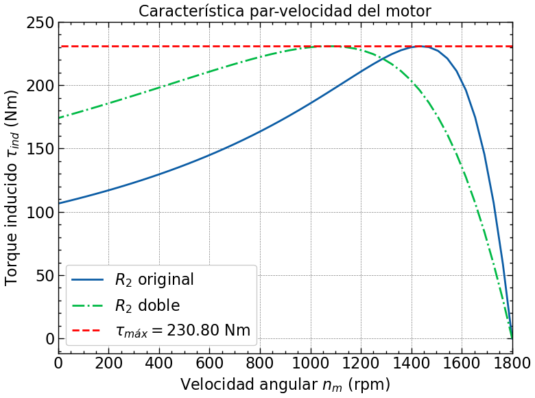

# Exercises

### Exercise 1

Se tiene un motor de inducción trifásico con conexión en estrella de 5 hp, 60 Hz, 1800 rpm y 440V con los
siguientes parámetros:

$r_1 = 1.5\\; \Omega,\\; r_2 = 1.2\\; \Omega$

$jX = 6\\; \Omega\\; (total),\\; jX_m = 110\\; \Omega$

$R_m = 900\\; \Omega$

$s = 0.2$

Calcular:

a) Velocidad del rotor\
b) corriente del motor\
c) Potencia del rotor\
d) Torque de salida\
e) Eficiencia del motor\
f) Calcular la eficiencia para un deslizamiento de $s=0.3$\
g) Calcular la eficiencia para un deslizamiento de $s=0.1$

Ecuaciones útiles:

$n_r=(1-s)n_g$

$I_r=V_F/Z$

$P_{sal}=I_r^2R_2/s$

$P=T\omega$

$P_{en}=3V_FI_{en}\cos(\theta)$

----

## 2. Velocity vs. torque (Chapman, pdf pág. 275):

Un motor de inducción con rotor devanado de 460 V, 25 hp, 60 Hz, con cuatro polos, conectado en Y, tiene las
siguientes impedancias en ohms por fase referidas al circuito del estator:

R1 = 0.641 $\Omega$,    R2 = 0.332 $\Omega$\
X1 = 1.106j $\Omega$,   X2 = 0.464j $\Omega$\
XM = 26.3j $\Omega$

a) ¿Cuál es el par máximo de este motor? ¿A qué velocidad y deslizamiento se presenta?\
b) ¿Cuál es el par de arranque del motor?\
c) Si se duplica la resistencia del rotor, ¿Cuál es la velocidad en que se presenta ahora el par\
   máximo? ¿Cuál es el nuevo par de arranque del motor?\
d) Calcule y haga la gráfica de la característica par-velocidad del motor tanto con la resistencia del rotor\
   original como con la resistencia del rotor al doble.

### Solution

a). - Par máximo                  $\rightarrow \tau_{max}$: 230.80 Nm.\
    - Deslizamiento en par máximo $\rightarrow s_{max}$: 0.2014.\
    - Velocidad en par máximo     $\rightarrow N_m\\; @T_{max}$: 1437.46 rpm

b). Par en el arranque -> $\tau$ en arranque: 106.56 Nm.

c). Si se duplica R2 (2R2: 0.664 ohms), el deslizamiento se duplica, al cual se presenta el par máximo:\
    - Deslizamiento duplicando R2          $\rightarrow s_{max}$@2R2: 0.4028.\
    - Velocidad del rotor con 2R2          $\rightarrow n_{m}$@2R2: 1074.92 rpm.\
    - El torque máximo no depende de R2    $\rightarrow \tau_{max}$: 230.80 Nm.\
    - Torque al arranque del rotor con 2R2 $\rightarrow \tau_{arranque}$@2R2: 174.06 Nm.

<figure>
    
    <figcaption>Figure 2. característica par-velocidad del motor.</figcaption>
     
</figure>

 
