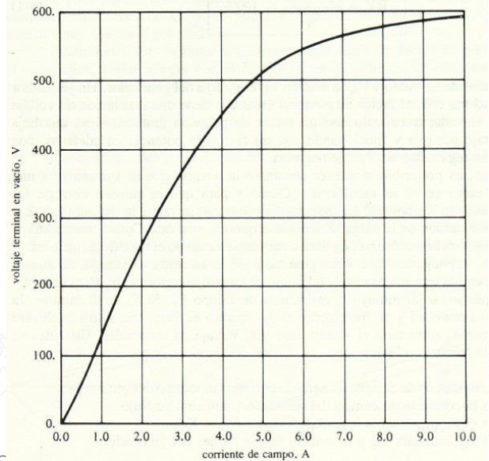

# Exercise 1 (ex1)

A 480 V, 60 Hz, 4-pole, delta-connected, synchronous generator has a synchronous reactance of j0.1 Ω and an
armature resistance of 0.015 Ω. Solve the following based on the given data:

a. What is the speed of the generator?
b. If a load is connected in delta drawing 1200 A with fp= 0.8 in lagging, how much field current is required to
   bring the load voltage to nominal (see the motor magnetization curve).
c. Draw the phasor diagram.
d. If mechanical and miscellaneous losses add up to 40 kW, core losses are 30 kW and field losses are neglected
   what is the efficiency of the generator?
e. Calculate P, Q and S at the load.
f. Induced torque for the load conditions.
g. Applied torque for load conditions.

## Generator magnetization curve example

